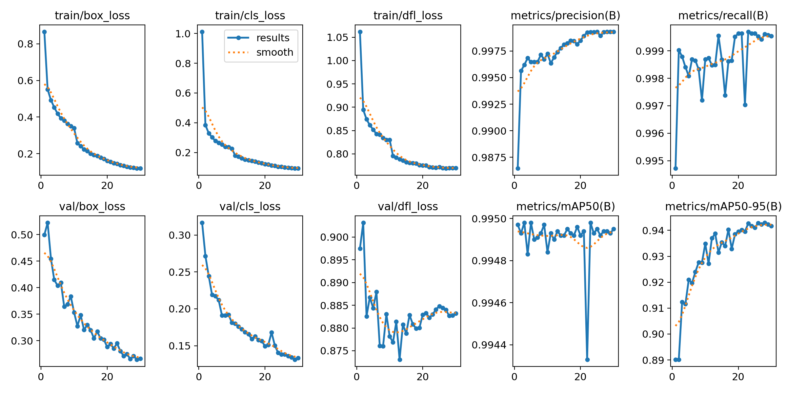
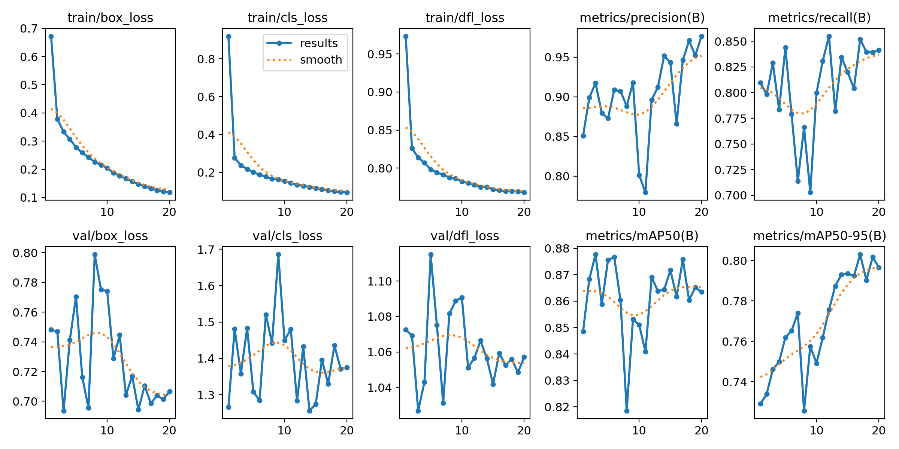

# 电力控制柜目标检测项目

基于YOLOv8的电力控制柜设备状态检测系统，实现对开关、压板、指示灯、变压器等16类目标的高精度检测。

## 项目概述

随着电力系统智能化的快速发展，变电站与控制柜的无人化、智能化巡检已成为行业发展的必然趋势。本项目利用深度学习目标检测技术，实现电力控制柜内关键设备状态的自动识别与检测，为电力系统智能运维提供技术支撑。

## 数据集

### 基本信息
- **图像数量**：3000张
- **目标类别**：16类
- **标注框总数**：26520个
- **平均目标数**：8-9个/图

### 类别体系
| 类别 | 说明 |
|------|------|
| switch-left/center/right | 开关分合状态 |
| platen-on/off | 压板投退状态 |
| red/green/red-green/green-green-red | 指示灯亮灭状态 |
| transformer-on/off | 变压器运行状态 |
| button-on/off | 按钮状态 |
| display-on/off | 显示屏状态 |
| other | 其他设备 |

### 数据特点
- **类别不平衡**：最大类（platen-off）9024个，最小类（green-green-red）仅70个，比例超过120:1
- **小目标占比高**：约39%的目标为小目标（面积<1%）
- **目标密度高**：单张图片平均8-9个目标，最多可达数十个
- **标注质量**：经过双层质检，修正越界框、重复框等问题

## 模型选型

### 为什么选择YOLOv8
1. **高精度**：在COCO数据集上达到SOTA水平
2. **速度快**：满足实时检测需求
3. **生态完善**：Ultralytics提供完整的训练、评估、部署工具链
4. **易于部署**：支持ONNX、TensorRT等多种导出格式
5. **社区活跃**：持续更新优化，问题响应快

### 模型规模
- **YOLOv8s**：平衡精度与速度，适合工业部署

## 训练结果

### 两次实验对比

本项目进行了两次关键实验，验证了数据泄露问题对结果的影响：

#### 第一次训练（随机划分）
使用随机划分的数据集进行训练，结果mAP异常高，后发现存在数据软泄露问题。



**主要指标**：
- mAP50: ~0.995
- mAP50-95: ~0.943

#### 第二次训练（聚类防泄露划分）
使用基于视觉相似度的聚类划分方法，确保相似图片不会同时出现在训练集和验证集中，结果更真实可靠。



**主要指标**：
- mAP50: 87.6%
- mAP50-95: 80.3%
- Precision: 94.6%
- Recall: 85.2%

### 结果分析
- **优势类别**：开关、压板等大目标检测精度高
- **少数类瓶颈**：样本量少的类别（如green-green-red）精度较低
- **小目标问题**：小目标检测效果仍有提升空间
- **类别不平衡**：通过重采样、数据增强等策略缓解

## 快速开始

### 环境安装
```bash
pip install ultralytics opencv-python matplotlib seaborn scikit-learn
```

### 数据预处理
```bash
python data_preprocess.py
```

### 模型训练
```bash
python train.py
```

### 模型评估
```bash
python evaluate.py
```

### 推理预测
```bash
python inference.py
```

## 优化方向

1. **更高分辨率**：使用1280×1280输入，提升小目标检测效果
2. **注意力机制**：引入CBAM、CA等注意力模块
3. **改进损失函数**：使用SIoU、WIoU等更先进的损失函数
4. **增强少数类**：针对少数类进行过采样和特定增强
5. **前沿模型**：尝试YOLOv9、YOLOv10等更新模型

## 应用场景

- 变电站智能巡检机器人
- 远程无人化控制柜监控中心
- 设备异常状态自动预警
- 电力设备智能运维管理平台

## 致谢
